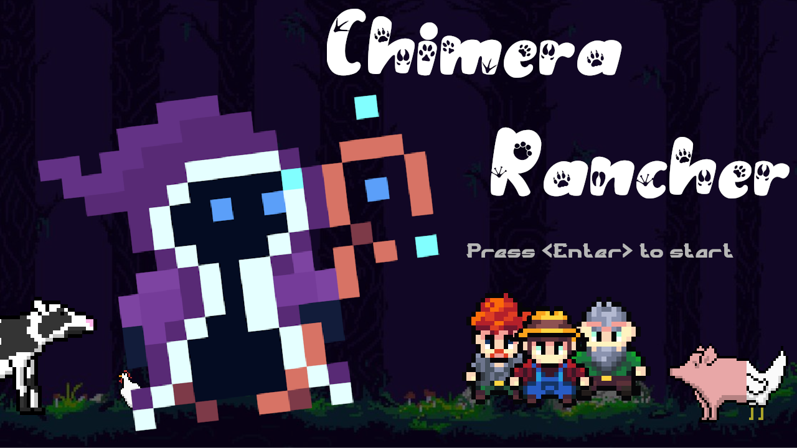

# Chimera Rancher

## Description

WIP

## How to build and run

## About us

- [cdsupina](https://micronote.tech/) 
- tigleym
- hedgein
- [nightlyside](https://nightlyside.github.io): French student in computer science and computer security engineering
